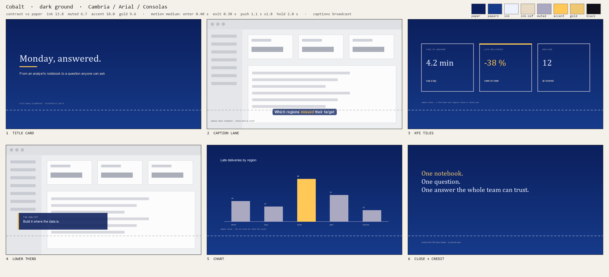
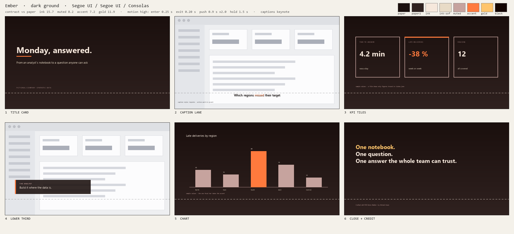
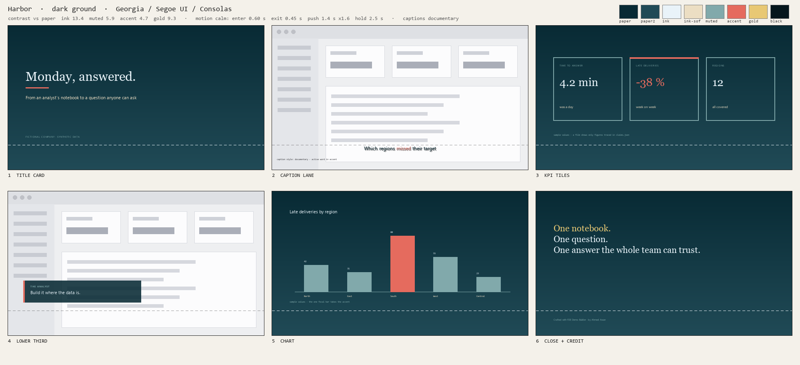
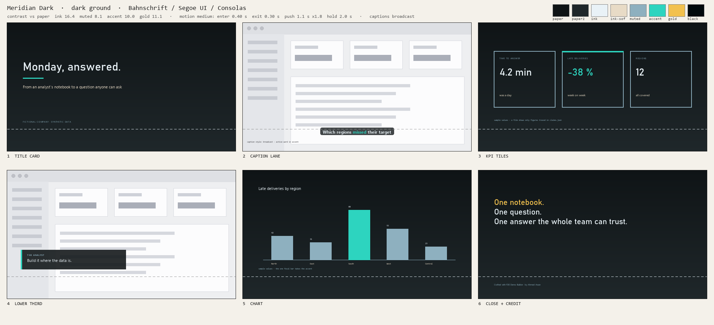
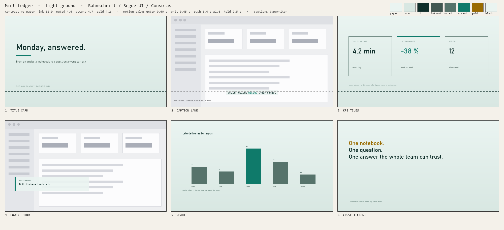
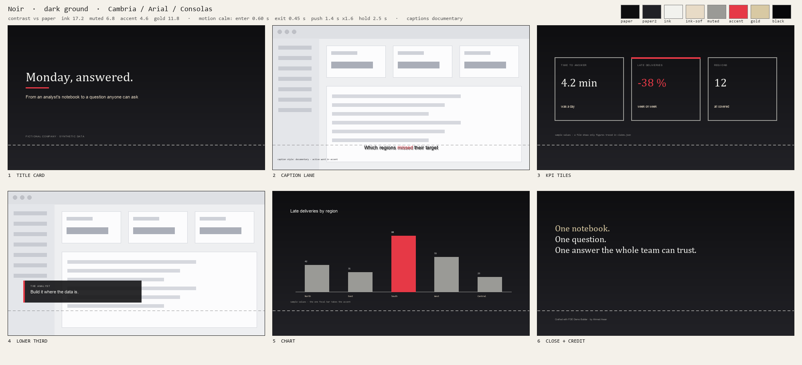
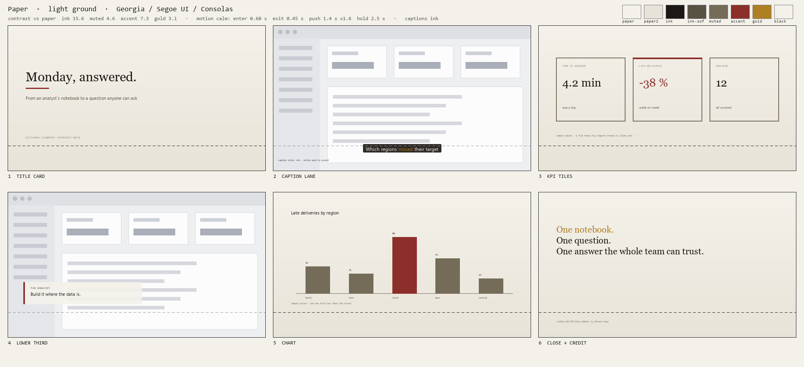
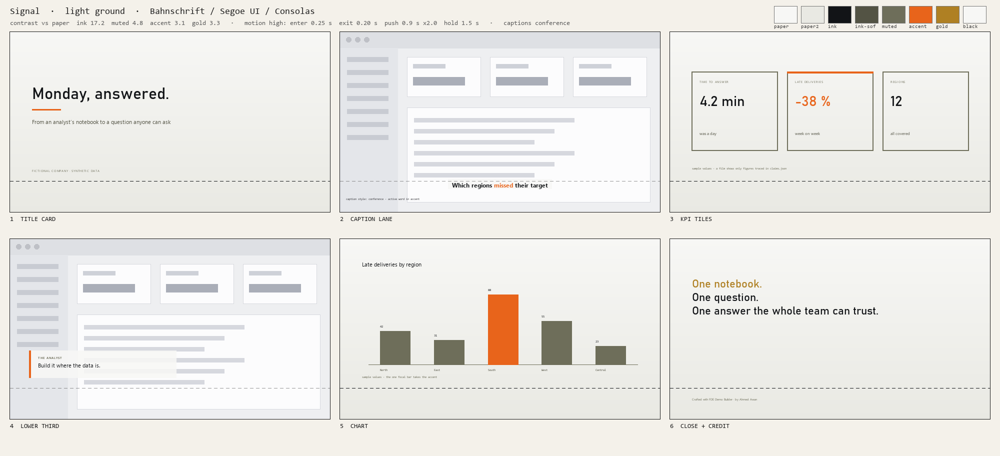
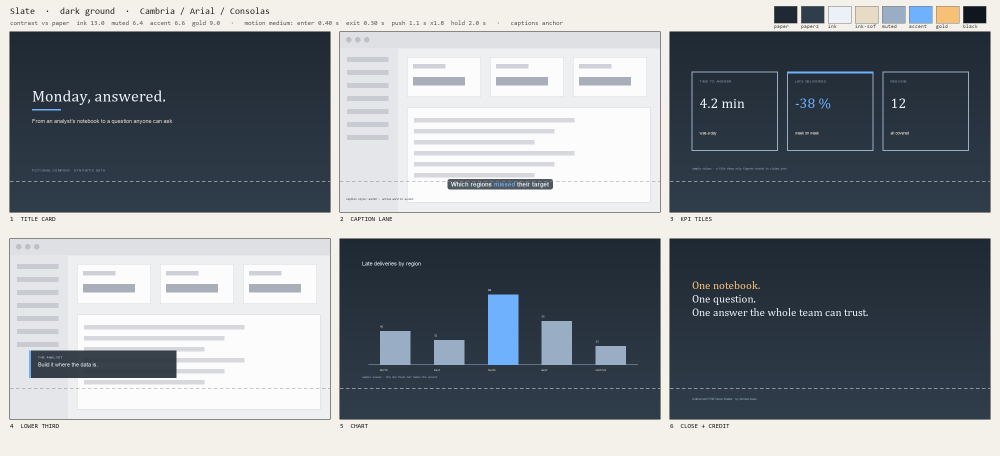
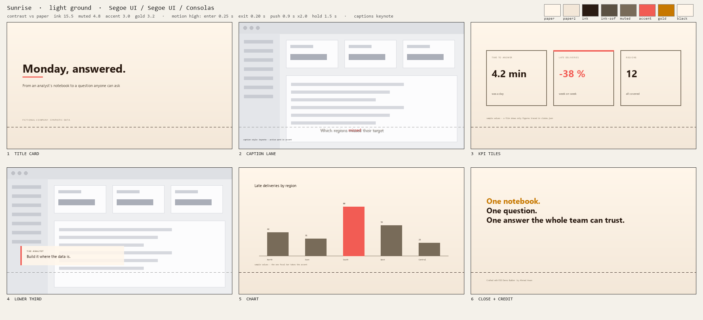

# Skins — ten complete looks for a film, approved before the build

A skin is one JSON file in the shape of `templates/skin_tokens.example.json` (the same token ids the scene reads as `--paper`,
`--ink`, `--accent` … on `:root`) plus the v5 sections a look needs to be *complete*: `type` (a pairing from fonts that ship with
Windows), `motion` (a measured profile from `references/motion-doctrine.md`), `captions` (the lane style), `seams` (the 2–3 techniques
the film may repeat) and `when_to_use`. Every colour is contrast-checked against the paper (WCAG 2.x): ink ≥ 7:1, ink-soft and muted
≥ 4.5:1, accent and gold ≥ 3:1. Nothing is pure #000 or #FFF.

Each skin was composed with `tools/brand_kit.py compose …` (hand-picked paper + accent, everything else derived and contrast-fixed)
and its sheet drawn with `tools/brand_kit.py --from-skin skins/<name>.json`. All names and figures are fictional; the sheets show
"sample values" — a film only shows figures traced in `claims.json`.

| Skin | Ground | Mood · type | Motion | Captions | Seams | Paper · accent · gold | Contrast vs paper | When to use |
|---|---|---|---|---|---|---|---|---|
| **Cobalt** `cobalt.json` | dark | corporate · Cambria / Arial / Consolas | medium | broadcast | cut-the-curve, inverse zoom-through | `#0B1F5C` · `#FFC857` · `#EFC771` | ink 13.8 · muted 6.7 · accent 10.0 · gold 9.6 | Financial-services and enterprise-software stories: cobalt ground, one warm yellow accent, Cambria display, medium pace. |
| **Ember** `ember.json` | dark | friendly · Segoe UI / Segoe UI / Consolas | high | keynote | cut-the-curve, zoom-through, waterfall | `#1A0F0D` · `#FF7A3D` · `#FFC46B` | ink 15.7 · muted 8.2 · accent 7.2 · gold 11.9 | Event sizzles and booth trailers: warm near-black ground, ember orange focal colour, keynote captions, high energy. |
| **Harbor** `harbor.json` | dark | editorial · Georgia / Segoe UI / Consolas | calm | documentary | cut-the-curve, inverse zoom-through | `#082A34` · `#E56B5E` · `#E8C874` | ink 13.4 · muted 5.9 · accent 4.7 · gold 9.3 | The house look: a calm, editorial booth film on a deep navy ground with one coral focal colour — the default when the brand gives you nothing. |
| **Meridian Dark** `meridian-dark.json` | dark | technical · Bahnschrift / Segoe UI / Consolas | medium | broadcast | cut-the-curve, zoom-through, rack-focus | `#0F1416` · `#2DD4BF` · `#F2C14E` | ink 16.4 · muted 8.1 · accent 10.0 · gold 11.1 | Developer and platform demos: near-black charcoal ground, electric teal focal colour, broadcast captions, medium pace. |
| **Mint Ledger** `mint-ledger.json` | light | technical · Bahnschrift / Segoe UI / Consolas | calm | typewriter | cut-the-curve, inverse zoom-through | `#EAF4F1` · `#0F7A6A` · `#9A6B00` | ink 12.9 · muted 4.6 · accent 4.7 · gold 4.2 | Data, ledger and audit-trail demos: pale mint ground, mono typewriter captions, calm pace that lets figures be read. |
| **Noir** `noir.json` | dark | corporate · Cambria / Arial / Consolas | calm | documentary | cut-the-curve, inverse zoom-through | `#0E0E10` · `#E63946` · `#D8C9A3` | ink 17.2 · muted 6.8 · accent 4.6 · gold 11.8 | Premium, understated product films: monochrome ground with a single red focal colour, documentary captions, calm pace. |
| **Paper** `paper.json` | light | editorial · Georgia / Segoe UI / Consolas | calm | ink | cut-the-curve, inverse zoom-through | `#F4F1EA` · `#8C2F2A` · `#AF8023` | ink 15.6 · muted 4.6 · accent 7.3 · gold 3.1 | Customer stories and executive briefings watched in a bright room: warm paper ground, serif display, oxblood accent, calm pace. |
| **Signal** `signal.json` | light | technical · Bahnschrift / Segoe UI / Consolas | high | conference | cut-the-curve, waterfall, rack-focus | `#F7F7F5` · `#E8641B` · `#AF8023` | ink 17.2 · muted 4.8 · accent 3.1 · gold 3.3 | Fast feature walkthroughs and launch teasers: white ground, signal orange, conference captions, high-energy motion. |
| **Slate** `slate.json` | dark | corporate · Cambria / Arial / Consolas | medium | anchor | cut-the-curve, combined | `#1F2933` · `#6FB1FC` · `#F6C177` | ink 13.0 · muted 6.4 · accent 6.6 · gold 9.0 | Corporate IT and operations films on a neutral slate ground — sits safely beside any product UI, anchor captions. |
| **Sunrise** `sunrise.json` | light | friendly · Segoe UI / Segoe UI / Consolas | high | keynote | cut-the-curve, zoom-through, waterfall | `#FFF6EA` · `#F25C54` · `#C77800` | ink 15.5 · muted 4.8 · accent 3.0 · gold 3.2 | Consumer-facing and HR / people films: warm light ground, coral accent, friendly Segoe UI pairing, high-energy motion. |

## Motion profiles (seconds on the film clock)

| Profile | Entry | Exit | Stagger (total · per item) | Push | Hold after push | Rack focus |
|---|---|---|---|---|---|---|
| calm | 0.60 s power4.out | 0.45 s sine.in | 0.5 s · 0.08 s | 1.4 s, ×1.3–1.6 | 2.5 s | not allowed |
| medium | 0.40 s power4.out | 0.30 s power2.in | 0.5 s · 0.06 s | 1.1 s, ×1.4–1.8 | 2.0 s | ≤ once per 8 s |
| high | 0.25 s expo.out | 0.20 s power3.in | 0.4 s · 0.04 s | 0.9 s, ×1.5–2.0 | 1.5 s | ≤ once per 8 s |

The numbers sit inside the doctrine: a single entry ≤ 0.8 s, exit ≈ 75 % of the entry, a stagger finishes inside 0.5 s with
0.04–0.08 s per item, a push lasts 0.9–2.0 s and lands ×1.3–×2.0, the dwell after it is ≥ 1 s. `brand_kit.py check` fails a skin
that leaves these ranges.

## Sheets

Six half-stage frames each (title card · caption lane over a synthetic product plate · KPI tiles · lower third · chart · close +
the mandatory credit). The dashed line at 83 % is the caption keep-out. Regenerate with
`for f in skins/*.json; do python tools/brand_kit.py --from-skin "$f"; done`.

### Cobalt

### Ember

### Harbor

### Meridian Dark

### Mint Ledger

### Noir

### Paper

### Signal

### Slate

### Sunrise

## Using a skin

- `film.json` → `"skin": "skins/harbor.json"` (or a project `skin_tokens.json` written by `brand_kit.py extract --logo …`).
- The scene reads `var(--paper)` etc.; the `motion`, `captions` and `seams` sections are advisory to the author and checked by
  `brand_kit.py check` — they do not move the clock.
- Prove a re-skin differentially (see `templates/skin_tokens.example.json`): render one still with the skin and one with the
  inverted probe; > 5 % of the 160x90 grey pixels must differ.
- A real brand: `python tools/brand_kit.py extract --logo assets/logo.png --site assets/site.png --bg dark --mood corporate
  --name acme --out skin_tokens.json --sheet out/style_sheet.png`, look at the sheet, then build.
